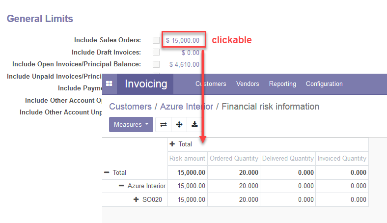

Adds a new page in partner to manage its *Financial Risk*. (Only visible
for User or Manager Financial Risk groups)

If any limit is exceeded, you won't be able to confirm any of its
invoices unless you are authorized (Financial Risk Manager group). You
can click in risk amount to view amount origin.

When a non-zero credit limit is set, the last modification date is saved
and displayed next to the credit limit.
