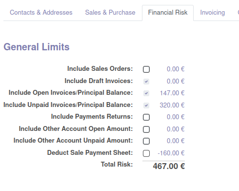
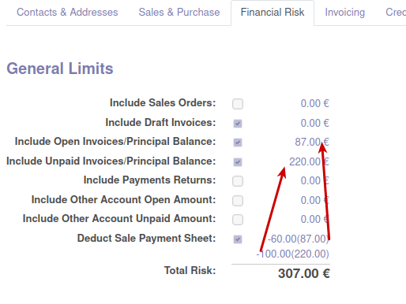

Extends Partner Financial Risk to allows you to deduct from the risk the amounts
collected on sale payment sheets pending reconciliation.

When *Deduct Sale Payment Sheet* is set each risk field is reduced depending of payment
sheet invoice status (type of debt) and shows amounts grouped by field risk.

